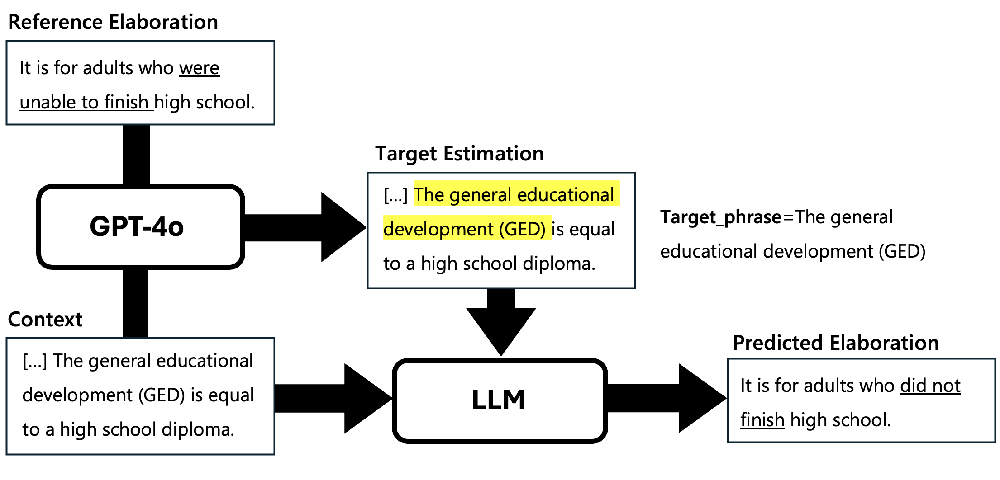

# 🚀 Elaborative Text Simplification via Target Estimation using Large Language Models  

This repository provides coding resources for the paper "Elaborative Text Simplification via Target Estimation using Large Language Models," presented at the NLP2025 Conference held in Nagasaki, Japan (言語処理学会第31回年次大会). It is designed to support further research in **Elaborative Text Simplification**, a growing field that focuses on enhancing text comprehension by adding relevant clarifications. 

---

## 🔹 Overview  
Our approach introduces a **target-specified generation** method, which explicitly identifies **elaboration targets**, a phrase or sentence requiring clarification—before generating an elaboration. Unlike traditional data-driven simplification methods, our framework more accurately reflects real-world scenarios where readers actively seek explanations for complex terms or concepts they do not understand.  

---

## 🔹 Data

This work is built upon the dataset introduced by [Srikanth & Li (2021)](https://aclanthology.org/2021.findings-acl.455/) in their paper **"Elaborative Simplification: Content Addition and Explanation Generation in Text Simplification."** Their study annotated 1.3K instances of elaborative simplification within the [Newsela corpus](https://aclanthology.org/Q15-1021/) developed by **Xu et al. (2015).**  

> **Note:** Due to **Newsela's copyright terms**, we are unable to publicly release the dataset used in this work.

## 🔹 License

This project is licensed under the MIT License.  
See the [LICENSE](LICENSE) file for details.

